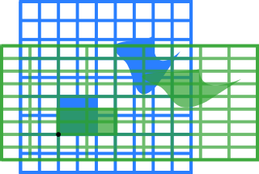
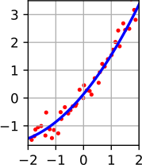
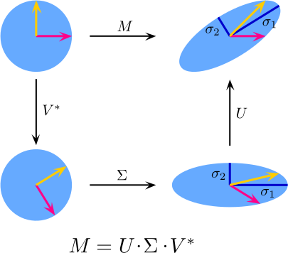

DRAFT!  DRAFT!

Welcome to the homepage of **Math F314 Linear Algebra**, Spring 2022, in the [Dept. of Mathematics and Statistics](http://www.uaf.edu/dms/) at the [University of Alaska Fairbanks](http://www.uaf.edu/).

#### Instructor:  [Ed Bueler](http://bueler.github.io/) ([elbueler@alaska.edu](mailto:elbueler@alaska.edu))

I hold [office hours](http://bueler.github.io/OffHrs.htm) in Chapman 306C.

### Getting Started

* Read the [Syllabus](assets/general/syllabus.pdf).

* See the [Schedule](assets/general/schedule.pdf).  Check it often to find out what happens next!

* The [Canvas course page](https://canvas.alaska.edu/courses/7017) is important!  Go there for your grades and solutions.

### Resources and Links

* Gil Strang is the author of our textbook.  His [website for the book](https://math.mit.edu/~gs/linearalgebra/) has lots of useful stuff.

* Complete solutions to all problems in the textbook are online:
  * [Chapter 1](https://math.mit.edu/~gs/linearalgebra/ila_sol5_ch01.pdf)
  * [Chapter 2](https://math.mit.edu/~gs/linearalgebra/ila_sol5_ch02.pdf)
  * [Chapter 3](https://math.mit.edu/~gs/linearalgebra/ila_sol5_ch03.pdf)
  * [Chapter 4](https://math.mit.edu/~gs/linearalgebra/ila_sol5_ch04a.pdf)
  * [Chapter 5](https://math.mit.edu/~gs/linearalgebra/ila_sol5_ch05a.pdf)
  * [Chapter 6](https://math.mit.edu/~gs/linearalgebra/ila_sol5_ch06.pdf)
  * [Chapter 7](https://math.mit.edu/~gs/linearalgebra/ila_sol5_ch07.pdf)
  * [Chapter 8](https://math.mit.edu/~gs/linearalgebra/ila_sol5_ch08.pdf)
  * [Chapter 9](https://math.mit.edu/~gs/linearalgebra/ila_sol5_ch09.pdf)
  * [Chapter 10](https://math.mit.edu/~gs/linearalgebra/ila_sol5_ch10.pdf)
  * [Chapter 11](https://math.mit.edu/~gs/linearalgebra/ila_sol5_ch11.pdf)
  * [Chapter 12](https://math.mit.edu/~gs/linearalgebra/ila_sol5_ch12.pdf)

* Gil Strang also has a [sequence of 34 video lectures on linear algebra](https://ocw.mit.edu/courses/mathematics/18-06-linear-algebra-spring-2010/video-lectures/).  They are organized by topic, and so it does not matter that they do not align to the current textbook perfectly.

* [Matrix world.](assets/images/matrix-world.pdf)

* Want to know what we will be studying?  See these Wikipedia pages:
   * [vectors](https://en.wikipedia.org/wiki/Vector_(mathematics_and_physics))
   * [matrices](https://en.wikipedia.org/wiki/Matrix_(mathematics))
   * [vector spaces](https://en.wikipedia.org/wiki/Vector_space)
   * [least-squares solutions](https://en.wikipedia.org/wiki/Least_squares)
   * [eigenvalues and eigenvectors](https://en.wikipedia.org/wiki/Eigenvalues_and_eigenvectors)
   * [singular value decomposition](https://en.wikipedia.org/wiki/Singular_value_decomposition)
   * [linear transformations](https://en.wikipedia.org/wiki/Linear_map)
   * [matrices for networks](https://en.wikipedia.org/wiki/Adjacency_matrix)

 "apply a squeeze matrix") &nbsp; &nbsp;  &nbsp; &nbsp; &nbsp; &nbsp; 

---
_Site design derived from [coordinated Calc I](https://uaf-math251.github.io/), an original [Jekyll](https://jekyllrb.com/) design by [David Maxwell](https://damaxwell.github.io/).
